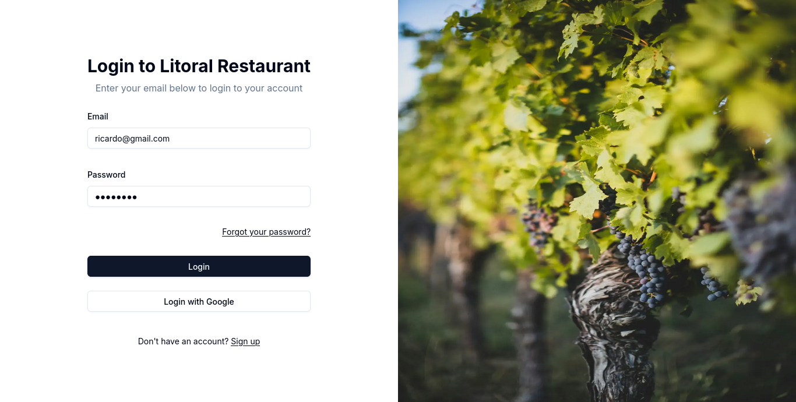
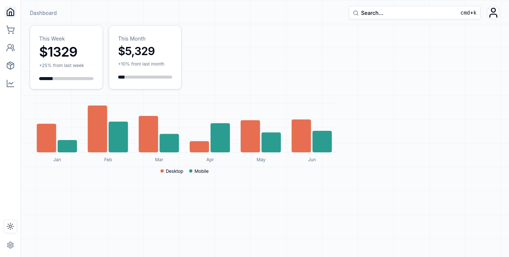
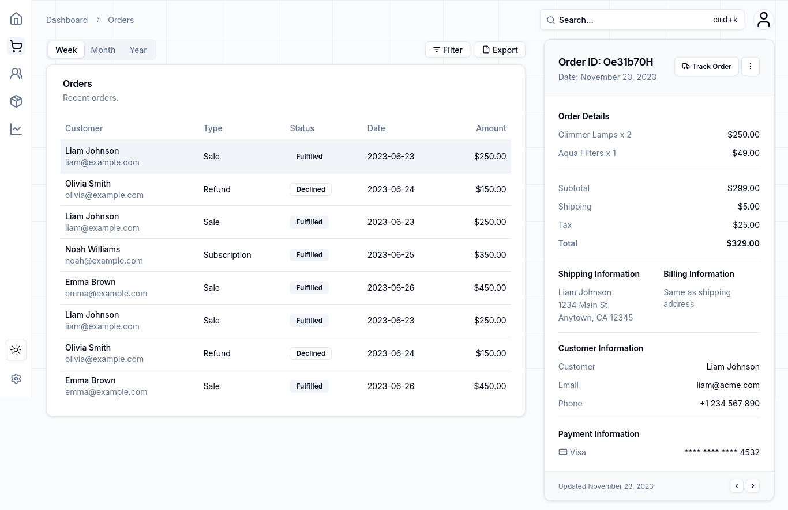
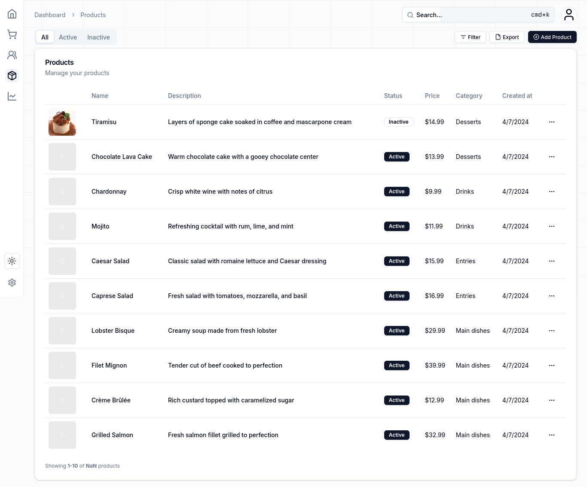
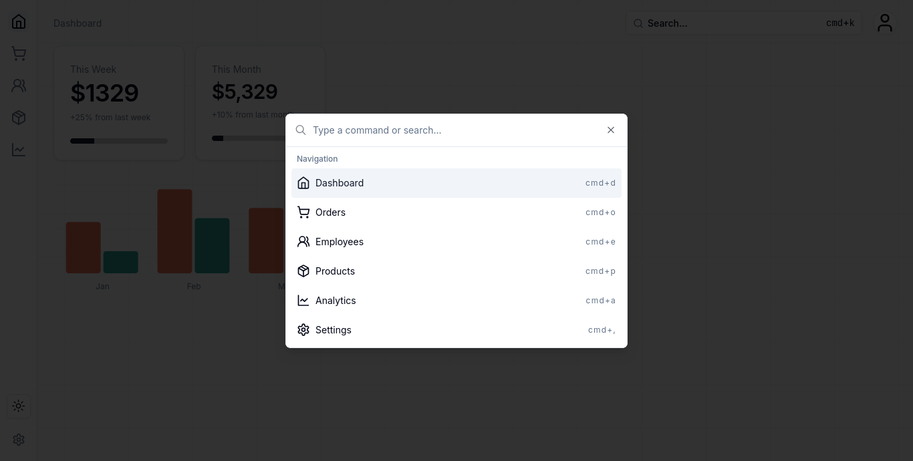

# Litoral Restaurant Dashboard

This project was made to practice **NextJS** and to try **Shadcn** components.

## Tecnologies

- NextJS
- TailwindCSS
- TypeScript

## Images

### Login



### Dashboard



### Orders



### Products



### Command bar



## Getting Started

- Install dependencies

```sh
pnpm install
```

- Fill .env.local file

```sh
cp .env.template .env.local
```

> [!NOTE]
> You need to fill the `TURSO_DB_URL` and `TURSO_DB_TOKEN` variables.

- Start development server

```sh
pnpm run dev
```
